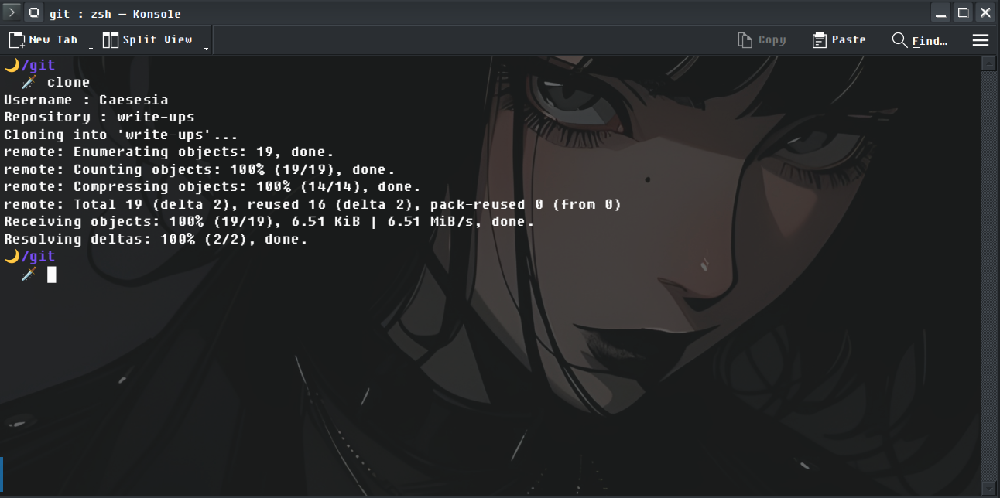

# Description

### "commands"

CE FICHIER DOIT ÊTRE RENOMMé ".commmands" ET SOURCé AFIN D'AVOIR DES COMMANDES UTILISABLES.

Il contient des commandes utilisables indépendamment de la position de l'utilisateur dans l'arborescence.

Exemples :

<pre><code>flem "MESSAGE"</code></pre>
Le raccourci ci-dessus exécute successivement ```git add .``` -> ```git commit -m $1``` -> ```git push```, où "$1" correspond à "MESSAGE" dans l'exemple.
Il suffit donc simplement d'ajouter un message de commit entre guillements après la commande.

<br>

<pre><code>clone</code></pre>

Ce raccourci est une commande interactive (= champs à remplir) qui permet de cloner un repository distant à l'emplacement actuel de l'utilisateur dans l'arborescence. Voici un exemple d'utilisation :



On peut voir ci-dessus que j'entre mon nom d'utilisateur et le repository que je souhaite cloner. Le clonage a lieu dans le répertoire courant, qui est "/git" dans mon cas.
